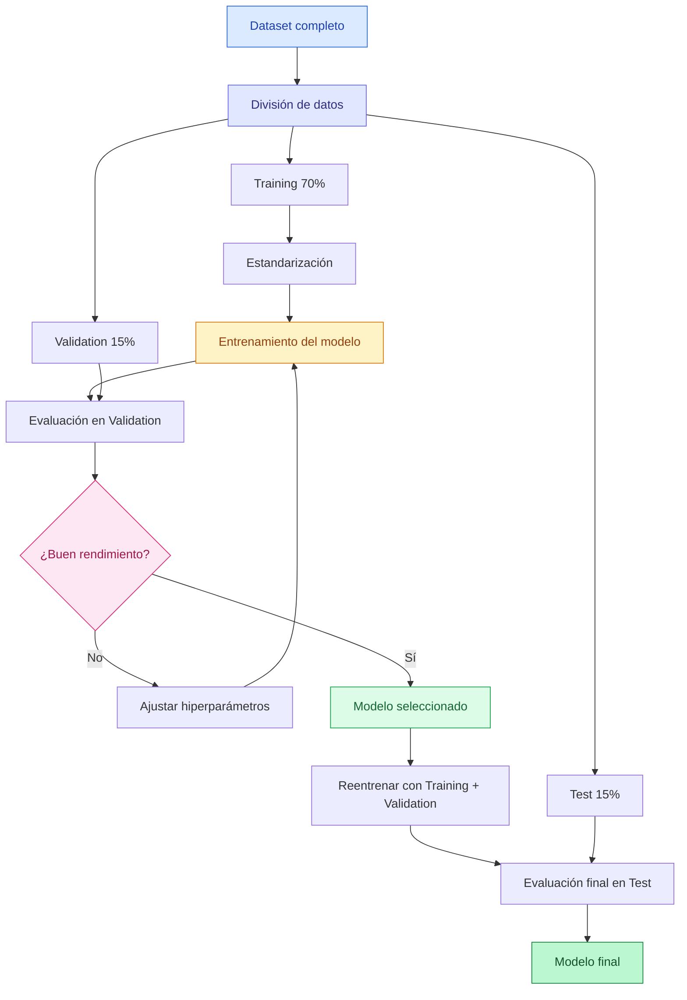

```mermaid
flowchart TD
    A["Dataset completo"] --> B["División de datos"]

    B --> C["Training 70%"]
    B --> D["Validation 15%"]
    B --> E["Test 15%"]

    C --> F["Estandarización"]
    F --> G["Entrenamiento del modelo"]

    G --> H["Evaluación en Validation"]
    D --> H

    H --> I{"¿Buen rendimiento?"}

    I -->|No| J["Ajustar hiperparámetros"]
    J --> G

    I -->|Sí| K["Modelo seleccionado"]
    K --> L["Reentrenar con Training + Validation"]
    L --> M["Evaluación final en Test"]
    E --> M

    M --> N["Modelo final"]

    style A fill:#dbeafe,stroke:#2563eb,color:#1e40af
    style B fill:#e0e7ff,stroke:#6366f1,color:#312e81
    style G fill:#fef3c7,stroke:#d97706,color:#92400e
    style I fill:#fce7f3,stroke:#db2777,color:#9d174d
    style K fill:#dcfce7,stroke:#16a34a,color:#166534
    style N fill:#bbf7d0,stroke:#15803d,color:#14532d
```